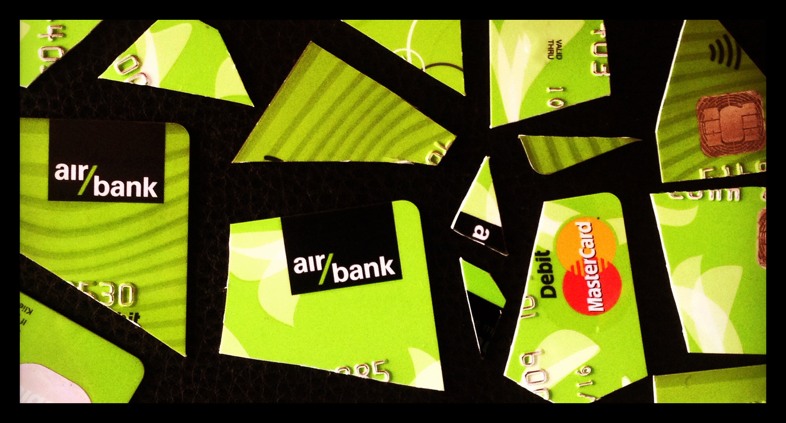

Být trans není úplně jednoduché ani když vás zrovna stát a zdravotnický establishment nešikanuje. A přestože situace je lepší, než byla před lety, pořád je co zlepšovat.

### Gatekeeping

Jak vypadá cesta trans ženy za proměnou? Nejprve se objedná k sexuologovi. Počká si dva--tři měsíce na termín. Pak se konečně dočká, přijde na schůzku. Nesmí říct nic špatně. Například nesmí říct že chce jen hormony a o operaci nestojí nebo z ní má strach. V tu chvíli není doopravdy trans a má smůlu.

Sexuologové totiž vědí, že nebinární trans lidé neexistují. Stejně jako neexistují bisexuálové. Jak známo, všichni jsme chodící klišé, jeden jako druhý, žena/muž uvězněni ve špatném těle &#8594; hormony &#8594; operace &#8594; problem solved.

Pokud naše začínající trans žena neřekne nic špatně a/nebo je dostatečně asertivní, dostane od sexuologa doporučení k psychologovi a endokrinologovi. Socialismus už se téměř podařilo vybudovat, takže za necelé čtyři měsíce jde k psychologovi.

U psychologa teprve vypukne ta správná legrace. Osobně jsem asi nezažila nic tak ponižujícího, jako když jsem slizkému pětašedesátníkovi musela dokazovat že jsem dostatečně žena. Že mi pak vrazil do ruky psycho- a IQ testy, poslal mě na chodbu, a po jejich vyplnění mi zabouchl dveře před nosem, aniž by jakkoliv naznačil jaký verdikt hodlá sdělit mému sexuologovi, to už byla jenom taková shnilá třešnička.

Takže dalšího čtvrt roku čekání na druhý termín u sexuologa. Tam jsem se s velkou úlevou dozvěděla, že psycholog rozhodl pozitivně, že jsem tu panenku a panáčka nakreslila dobře, že tedy jsem správná trans žena, a že ty hormony dostanu i když chirurgickou změnu nechci.

Blbé je, když řeknete něco špatně a troll pod mostem vás za trans neuzná. Třeba rozhodne že teď ještě nejste, ale možná že časem budete. Takže dál trpíte dysforií, chce se vám brečet kdykoliv se podíváte do zrcadla, testosteron vaše tělo dál nevratně ničí. Tolik k *primum non nocere*. Pokud se odvážíte (a nespácháte radši sebevraždu), můžete se tam jít za půl roku nebo rok ponižovat znovu, a tentokrát už si snad dáte dobrý pozor abyste neřekly něco, co nechce slyšet.

### Změna dokladů

Počítáte se mnou? Těch osm-devět-patáct měsíců nesmyslného čekání a zhoršující se dysforie uběhlo jako voda. Ale konečně v ruce máte vytouženou krabičku léků. Poprvé v životě se cítíte dobře a spokojeně. Najednou zjistíte že sama sebe dokonce můžete mít ráda.

Ale tím vaše trable nekončí. Chcete si změnit jméno. Akorát že ženská jména jsou jen pro ženy, a vy pro tento stát stále ještě dost žena nejste.

Takže si jdete změnit jméno na dočasné. Nový rodný list, občanku, pas, řidičák, zbroják, registraci auta, povinné ručení, zdravotní daň, sociální daň, účty v bance, nájemní smlouvu, všchno dočasné. A nemůžete mít jméno které chcete, musíte si vybrat ze seznamu asi 50 bezpohlavních jmen. Nebo hledat důkazy o obourodnosti svého zvoleného jména a znalce ochotného vydat posudek.

### Nucené sterilizace

Pokud operaci z jakéhokoliv důvodu nechcete: tovární konfigurace vám dysforii nepůsobí; bojíte se komplikací; chcete šanci v budoucnu splodit dítě; výsledky operací vám nepřijdou dost dobré; nechcete rok každodenní bolestivé dilatace; nebo cokoliv jiného, **máte smůlu**.

Dočasné jméno a špatné písmenko v kolonce "pohlaví" vám zůstane dokud se nenecháte sterilizovat. Musíte si dávat zatracený pozor, abyste neprovedly něco, za co hrozí odnětí svobody.

Je úplně jedno, že žijete jako žena, že máte ženskou postavu, obličej, pleť, prsa... Pro Českou republiku jste muž, a pokud něco provedete, skončíte v mužském vězení. Kde vás buďto na samotku šoupnou rovnou, nebo teprve až když vás někdo znásilní. Inu, spravedlnost. Holt nemáte být pre-op trans žena.

Ani nemluvě o drobných radostech typu když si někdo všimne toho "M". Třeba při cestování to může být velice příjemné, hodinka v cele, ověřování totožnosti, zmeškaný let...

### Jak to napravit

**Odstranit gatekeeping**. Pokud někdo přijde k sexuologovi a chce teď hned hormony, ať jsou poučeni o rizicích, podepíší informovaný souhlas, a dostanou předpis ten samý den. Cokoliv jiného aktivně působí trans lidem utrpení. A proč? Aby psycholog ochránil hypotetické, dospělé, svéprávné cis psychotiky před antikoncepcí, kterou lékaři jinak předepisují 14 letým holkám jako lentilky?

Je naprosto nepřípustné, aby nějaký psycholog bránil lidem, kteří nesplňují jeho subjektivní představy ohledně podoby správných žen či mužů, v přístupu k lékům, které dotyční nutně potřebují.

Ostatně v Thajsku jsou všechny tyto léky volně prodejné v lékárnách, a opravdu tam nedochází k žádné apokalypse, kde by lidé hromadně brali cross-sex hormony aniž by k tomu měli dobrý důvod. 

**Odstranit nutnost sterilizace** pro legální změnu rodu. Nenutit lidi do volby mezi zachováním své tělesné autonomie a integrity, a autentickým životem, bez vyoutování se při každém ukázání dokladů. Nenutit nikoho do bezpohlavních dočasných jmen a zbytečné administrativy s měněním všech dokladů dvakrát.

Trans muži často operace spodku nepodstupují. Jejich výsledky jsou větší kompromis, a chybějící penis u muže společnost asi vnímá míň hrozně, než nadbytečný u ženy. Nemají potřebu se zbavovat vaječníků, protože exogenní testosteron estrogeny naprosto spolehlivě přebije. A nechat se řezat jenom protože nějaký od reality odtržený zákonodárce nedomyslel důsledky svého textu? No kde to jsme...

Trans ženy to mají v určitém ohledu poněkud jednodušší. Většině penis intenzivně vadí, po operaci touží, spermie lze snadno zmrazit a mít děti později a [některé MtF operace mají krásné výsledky](/aikchol-vs-motol/). 

Ale i zcela binární, po neovagině toužící trans ženě může v tom roce nebo dvou, mezi diagnózou a operací, někdo skočit pod auto. A opravdu si nemyslím, že být pre-op trans člověkem je takový zločin, že zasluhují život se špatnými doklady, odpírání preventivní péče kvůli špatnému rodnému číslu, a v případě odnětí svobody jako bonus garantované sexuální násilí a celý trest na samotce. 