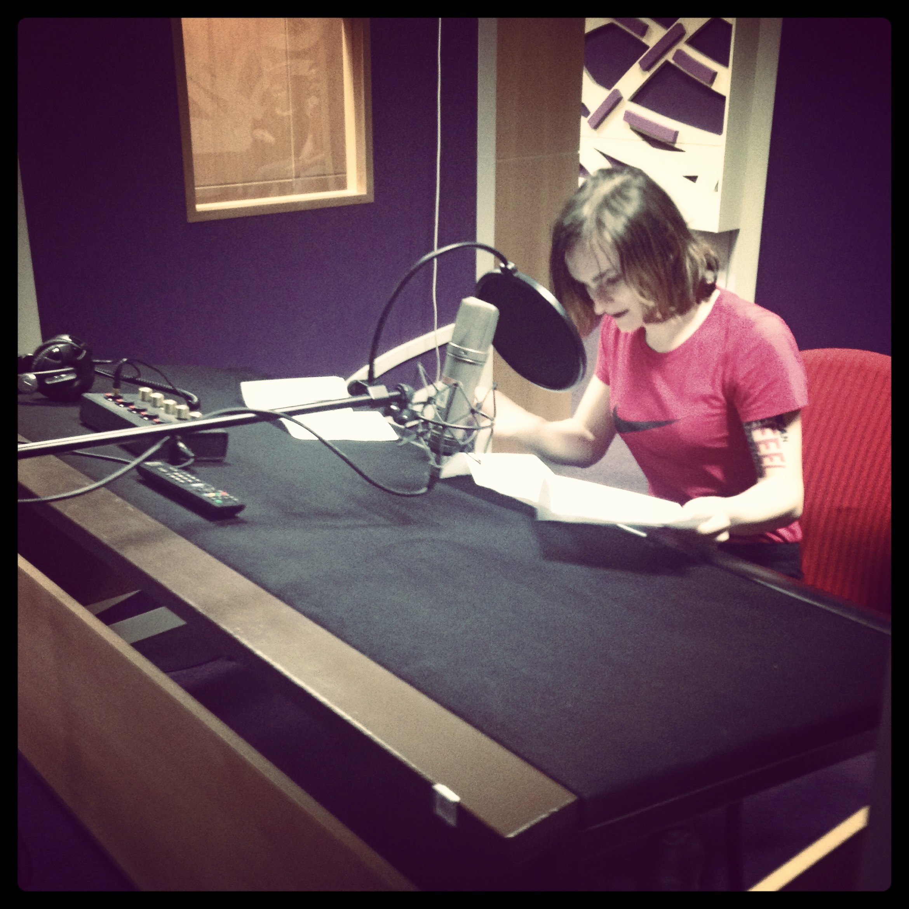

Tento víkend jsem se zúčastnila [hlasového workshopu Jde ti o hrdlo?](http://www.hrajdivadlo.cz/#!hrdlo/sx2vv) pořádaného [hrajdivadlo.cz](http://hrajdivadlo.cz).

Bylo to super. Já jsem tedy už dost věcí znala, dřív jsem chodila na hlasový trénink a teď se pokouším zpívat, a je to víceméně to samé. Ale bylo fajn si to znovu připomenout a zopakovat a vyzkoušet v trochu jiném kontextu.

### Sobota

Workshop trval celý víkend. V sobotu jsme začali zlehka, čtením super-dlouhé divnověty, dechovými cvičeními a tréninkem zesilování hlasu. Celou dobu jsem byla lehce nervozní, protože předminulý rok jsem strávila snahou mluvit vyšším tónem, než jak mi hlasivky narostly, a tady jsme se naopak snažili mluvit hlasem o pár tónů hlubším, jelikož zní lépe a příjemněji. A já se bála abych nepřestřelila.  

Co mě překvapilo, že zřejmě umím docela dobře umluvit relativně velikou místnost; jeden kolega mi pak na konci říkal, že by nechtěl, abych ho někdy seřvala, že by se fakt bál. Muhaha.

Každopadně největším sobotním highlightem bylo secvičení scénky, ve které jsme měli ztvárnit zadanou situaci, ale nesměli jsme říkat nic jiného, než jeden svůj jazykolam.

<figure>
  <iframe width="100%" height="336" style="margin: 0 auto;" src="https://www.youtube.com/embed/7MLsNIJWci4" frameborder="0" allowfullscreen></iframe>
  <figcaption>Naše scénka Pět kop konopí ⨉ Nesnese se sestrou</figcaption>
</figure>

### Neděle

V neděli jsme pokračovali rezonančními cvičeními (a předčítáním oplzlých a sprostých básniček, které jsme si měli připravit za domací úkol, na což jsem se regulérně vykašlala), pak byla svačina a trocha času na přípravu čtení povídek  [Ondřeje Tučka ze sbírky Kachnička](https://www.kosmas.cz/knihy/141270/kachnicka/)---doporučuju, mně se moc líbily. 

<figure class="pull-right">
  
  <figcaption>Julie ve studiu České televize</figcaption>
</figure>

Nakonec jsme se přesunuli na Kavčí hory do dabingového studia České televize, kde jsme měli příležitost nabyté znalosti zúročit, a zkusit si namluvit zvukovou vizitku, básničku a nějakou z výše zmíněných krátkých povídek.

Byla to zajímavá zkušenost, akorát já před tím mikrofonem dostala hroznou trému a nezabral žádný z triků na její zvládání, o kterých jsme si předtím říkali. Ale aspoň už to příště nebude poprvé.

### Šla bych znovu?

Určitě. Ještě se těším až nám Marek Doležel pošle slíbené materiály; jedna věc je si tyhle věci vyzkoušet na workshopu, druhá věc je potom pravidelně trénovat, zautomatizovat si je, a dokázat je uplatnit v reálném životě.

Každopádně to byl úžasný víkend a dala bych si ho klidně znovu. Kurz asi dozná jistých změn, možná příště bude méně účastníků (nás bylo 13 a bylo to docela hodně). Pokud vás to jenom trochu zajímá, [můžete se předběžně přihlásit](http://www.hrajdivadlo.cz/#!hrdlo/sx2vv), aby vám další termín neutekl. 