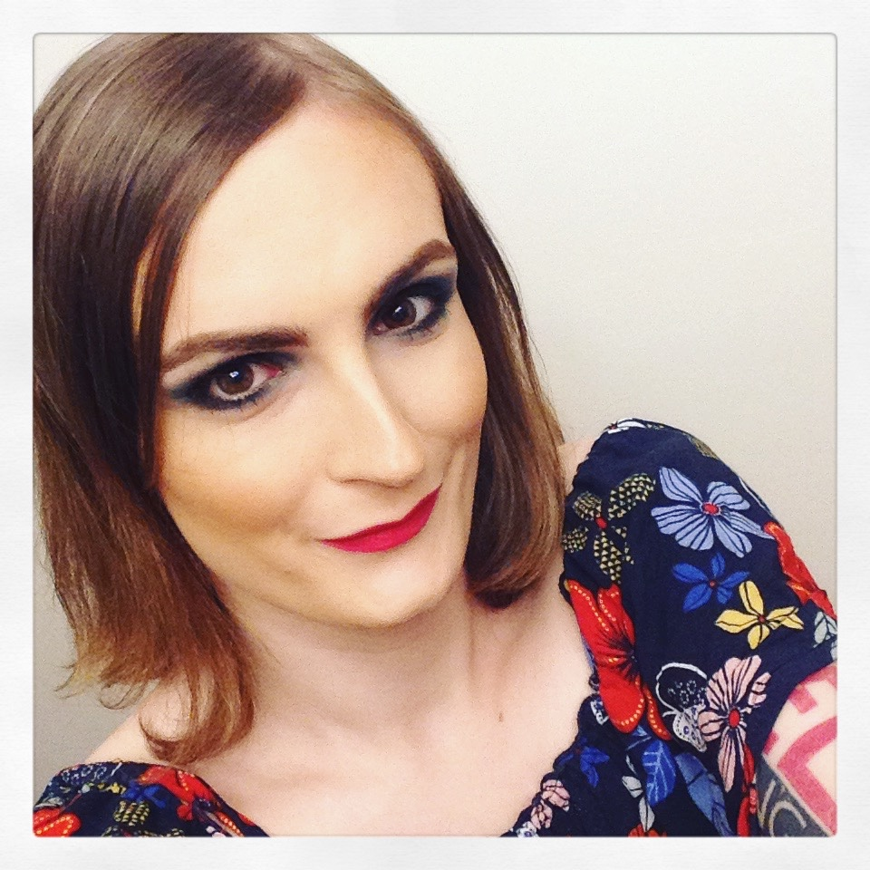

Před pár týdny jsem jednou večer na Facebooku narazila na událost vernisáže výstavy Petra Jedináka [Orgasmické portréty](https://facebook.com/events/1256354914375541/). Přijďte, je to v pondělí 8. srpna v Karlíně. Proklikala jsem se na Petrův web a všimla si nenápadné větičky:

> Chcete-li se stát rovněž součástí tohoto projektu, neváhejte mě oslovit.

A bylo jasno. Tu samou noc jsem mu napsala, a pak jsem Terku další dva týdny otravovala tím, jak se nemůžu dočkat a jaká to bude veliká zábava.

Podstatnou část motivace tvořila, nemá cenu si nic nalhávat, moje potřeba externí validace. A nechat se vyfotit při masturbaci a fotku pak vyvěsit v galerii na mezinárodní den ženského orgasmu (ano, to existuje), to je pořádná porce validace. Ale taky mě fascinuje technika focení na skleněné desky, při které vznike jeden jediný neduplikovatelný, nezvětšovaný originál. Kdyby fotil na moderní film, neřku-li digitálně, tak by mě to asi nelákalo; určitě ne natolik, abych mu sama proaktivně psala.

<figure class="pull-left">
  
</figure>

Pár dní předem jsem se domluvila s [Lenkou](https://facebook.com/LenkaOdehnalovaMakeUpArtist/) aby mě namalovala---a taky abych tam nešla sama, kdyby se ukázalo že je to nějakej divňák, kterážto obava se naštěstí ukázala lichá---a ve čtvrtek jsme se sešly u něj v ateliéru.

Já jsem si ten den vzala volno, nechtěla jsem být nucena přepínat do maskulinní energie, což se při dohadování věcí v práci snadno může stát, a radši jsem šla ráno na lekci zpěvu a zbytek dne se různě nahezkávala, opečovávala a všelijak jinak připravovala 😇

První hodinu zabralo Lence mě nalíčit, ale pak odešla a bylo třeba začít. Byl mi vysvětlen postup: sedneš si tady na tu tvrdou stoličku u zdi, obklopená čtveřicí blesků a obrovskou kamerou, a začneš masturbovat.

*"A máš na to pět minut."*

To mě trochu zarazilo, známe se sotva hodinu a už mě zkouší subit. Tedy, ne že by se mi to nelíbilo... I když to v minulosti vždycky dopadlo tak, že mi někdo přikázal ať se udělám, a tím prakticky garantoval že orgasmu nedosáhnu. 

Ale ten požadavek, jak vyšlo najevo, byl nudně technický: Po pěti minutách ze světlocitlivé vrstvy kolodia vyprchá éter a již ji není možno vyvolat. Což se  v případě první desky zřejmě i trochu stalo.

Dál to byla scéna jak z fantazie mého bývalého partnera: já jsem trpěla na nepohodlné stoličce obložená světly, snažila se udělat do těch pěti minut, a Petr seděl na posteli, pokuřoval, s pobaveným výrazem sledoval dění, a občas si mě u toho vyfotil zrcadlovkou.

Na třetí pokus se mi podařilo to stihnout. Ještě jsem vzbudila trochu pohoršení na balkónku s výhledem do parku---nějak se mi v té post-orgasmické spokojenostní rozněžněnosti nechtělo oblékat; a proč taky vlastně. Můj příští byt musí nutně mít balkón na kterém se budu moci nahá <s>předvádět</s> opalovat. Počkala jsem, než na mokrých deskách začne alespoň něco být vidět, a byl čas vyrazit za Terezkou.

Teď už si jenom rozmyslet nějakou reprezentativní úchylku do jeho dalšího projektu [Karneval neřesti](http://jedinak.cz/carnival-of-kink/)...